# ICLR 2025 Main Conference Papers

**Summary:** 36 papers with extracted content:
- 📊 Total images: 44031
- 📋 Total tables: 33468
- 📄 Total files: 77499

*Note: Equations have been filtered out and are not included.*

---

# ICLR 2025 Main Papers - Part 20 of 100

## 目录 (Table of Contents)

1. [Enhancing Uncertainty Estimation and Interpretability with Bayesian Non-negative Decision Layer](#Enhancing-Uncertainty-Estimation-and-Interpretability-with-Bayesian-Non-negative-Decision-Layer)
2. [MolSpectra: Pre-training 3D Molecular Representation with Multi-modal Energy Spectra](#MolSpectra-Pre-training-3D-Molecular-Representation-with-Multi-modal-Energy-Spectra)
3. [Building, Reusing, and Generalizing Abstract Representations from Concrete Sequences](#Building-Reusing-and-Generalizing-Abstract-Representations-from-Concrete-Sequences)
4. [(Mis)Fitting Scaling Laws: A Survey of Scaling Law Fitting Techniques in Deep Learning](#MisFitting-Scaling-Laws-A-Survey-of-Scaling-Law-Fitting-Techniques-in-Deep-Learning)
5. [A Single Goal is All You Need: Skills and Exploration Emerge from Contrastive RL without Rewards, Demonstrations, or Subgoals](#A-Single-Goal-is-All-You-Need-Skills-and-Exploration-Emerge-from-Contrastive-RL-without-Rewards-Demonstrations-or-Subgoals)
6. [Isometric Regularization for Manifolds of Functional Data](#Isometric-Regularization-for-Manifolds-of-Functional-Data)
7. [Beware of Calibration Data for Pruning Large Language Models](#Beware-of-Calibration-Data-for-Pruning-Large-Language-Models)
8. [Active Learning for Neural PDE Solvers](#Active-Learning-for-Neural-PDE-Solvers)
9. [Which Tasks Should Be Compressed Together? A Causal Discovery Approach for Efficient Multi-Task Representation Compression](#Which-Tasks-Should-Be-Compressed-Together-A-Causal-Discovery-Approach-for-Efficient-Multi-Task-Representation-Compression)
10. [MACPO: Weak-to-Strong Alignment via Multi-Agent Contrastive Preference Optimization](#MACPO-Weak-to-Strong-Alignment-via-Multi-Agent-Contrastive-Preference-Optimization)
11. [Scalable Universal T-Cell Receptor Embeddings from Adaptive Immune Repertoires](#Scalable-Universal-T-Cell-Receptor-Embeddings-from-Adaptive-Immune-Repertoires)
12. [ZeroDiff: Solidified Visual-semantic Correlation in Zero-Shot Learning](#ZeroDiff-Solidified-Visual-semantic-Correlation-in-Zero-Shot-Learning)
13. [Self-Supervised Diffusion MRI Denoising via Iterative and Stable Refinement](#Self-Supervised-Diffusion-MRI-Denoising-via-Iterative-and-Stable-Refinement)
14. [BlueSuffix: Reinforced Blue Teaming for Vision-Language Models Against Jailbreak Attacks](#BlueSuffix-Reinforced-Blue-Teaming-for-Vision-Language-Models-Against-Jailbreak-Attacks)
15. [Adaptive Methods through the Lens of SDEs: Theoretical Insights on the Role of Noise](#Adaptive-Methods-through-the-Lens-of-SDEs-Theoretical-Insights-on-the-Role-of-Noise)
16. [Failures to Find Transferable Image Jailbreaks Between Vision-Language Models](#Failures-to-Find-Transferable-Image-Jailbreaks-Between-Vision-Language-Models)
17. [Learning Evolving Tools for Large Language Models](#Learning-Evolving-Tools-for-Large-Language-Models)
18. [Feature Responsiveness Scores: Model-Agnostic Explanations for Recourse](#Feature-Responsiveness-Scores-Model-Agnostic-Explanations-for-Recourse)
19. [A Spark of Vision-Language Intelligence: 2-Dimensional Autoregressive Transformer for Efficient Finegrained Image Generation](#A-Spark-of-Vision-Language-Intelligence-2-Dimensional-Autoregressive-Transformer-for-Efficient-Finegrained-Image-Generation)
20. [GaussianBlock: Building Part-Aware Compositional and Editable 3D Scene by Primitives and Gaussians](#GaussianBlock-Building-Part-Aware-Compositional-and-Editable-3D-Scene-by-Primitives-and-Gaussians)
21. [Improving Instruction-Following in Language Models through Activation Steering](#Improving-Instruction-Following-in-Language-Models-through-Activation-Steering)
22. [Scaling Autonomous Agents via Automatic Reward Modeling And Planning](#Scaling-Autonomous-Agents-via-Automatic-Reward-Modeling-And-Planning)
23. [Explaining Modern Gated-Linear RNNs via a Unified Implicit Attention Formulation](#Explaining-Modern-Gated-Linear-RNNs-via-a-Unified-Implicit-Attention-Formulation)
24. [PFDiff: Training-Free Acceleration of Diffusion Models Combining Past and Future Scores](#PFDiff-Training-Free-Acceleration-of-Diffusion-Models-Combining-Past-and-Future-Scores)
25. [Learning to Communicate Through Implicit Communication Channels](#Learning-to-Communicate-Through-Implicit-Communication-Channels)
26. [RESfM: Robust Deep Equivariant Structure from Motion](#RESfM-Robust-Deep-Equivariant-Structure-from-Motion)
27. [Video In-context Learning: Autoregressive Transformers are Zero-Shot Video Imitators](#Video-In-context-Learning-Autoregressive-Transformers-are-Zero-Shot-Video-Imitators)
28. [ChroKnowledge: Unveiling Chronological Knowledge of Language Models in Multiple Domains](#ChroKnowledge-Unveiling-Chronological-Knowledge-of-Language-Models-in-Multiple-Domains)
29. [Aligning Visual Contrastive learning models via Preference Optimization](#Aligning-Visual-Contrastive-learning-models-via-Preference-Optimization)
30. [MGDA Converges under Generalized Smoothness, Provably](#MGDA-Converges-under-Generalized-Smoothness-Provably)
31. [Making Text Embedders Few-Shot Learners](#Making-Text-Embedders-Few-Shot-Learners)
32. [A Solvable Attention for Neural Scaling Laws](#A-Solvable-Attention-for-Neural-Scaling-Laws)
33. [ST-GCond: Self-supervised and Transferable Graph Dataset Condensation](#ST-GCond-Self-supervised-and-Transferable-Graph-Dataset-Condensation)
34. [Learning Successor Features with Distributed Hebbian Temporal Memory](#Learning-Successor-Features-with-Distributed-Hebbian-Temporal-Memory)
35. [Inspection and Control of Self-Generated-Text Recognition Ability in Llama3-8b-Instruct](#Inspection-and-Control-of-Self-Generated-Text-Recognition-Ability-in-Llama3-8b-Instruct)
36. [When GNNs meet symmetry in ILPs: an orbit-based feature augmentation approach](#When-GNNs-meet-symmetry-in-ILPs-an-orbit-based-feature-augmentation-approach)

---

## Enhancing Uncertainty Estimation and Interpretability with Bayesian Non-negative Decision Layer

### Images

### Tables

## Enhancing Uncertainty Estimation and Interpretability with Bayesian Non-negative Decision Layer

### Images

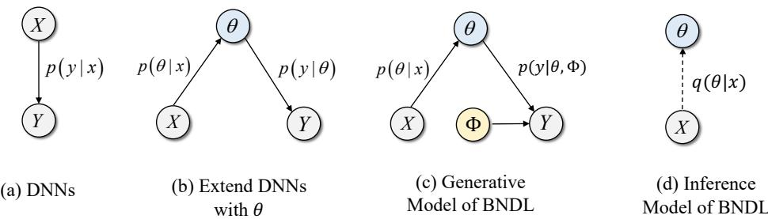

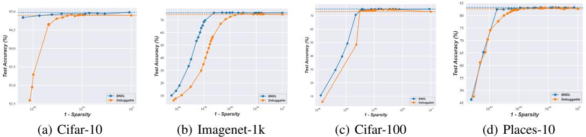

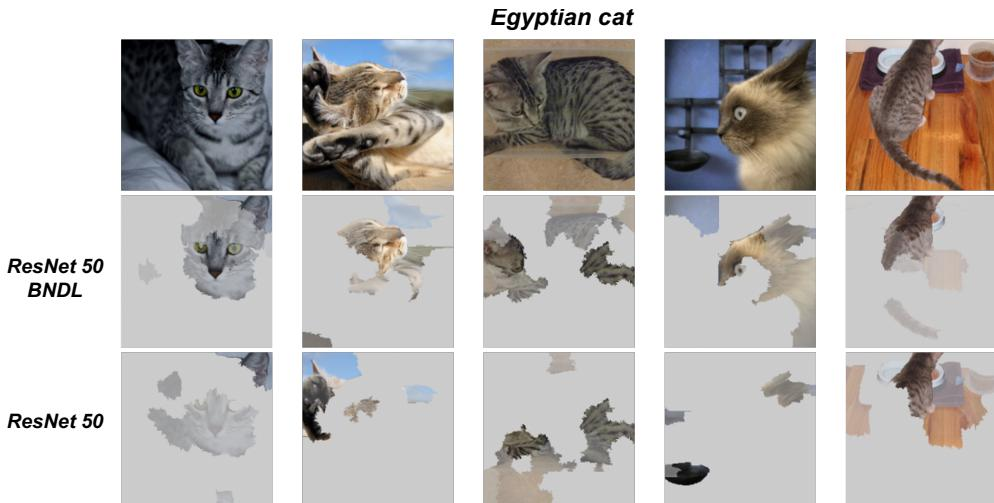

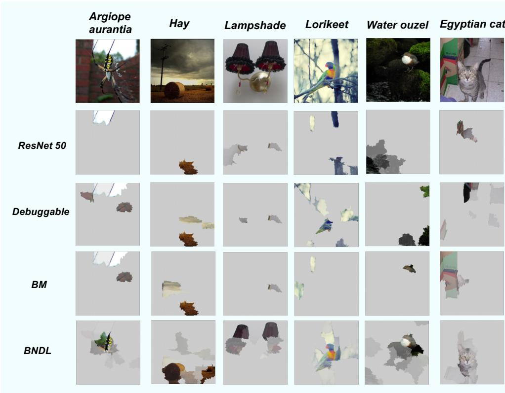

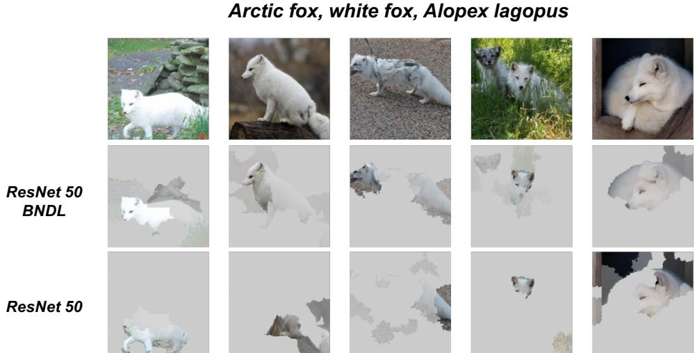

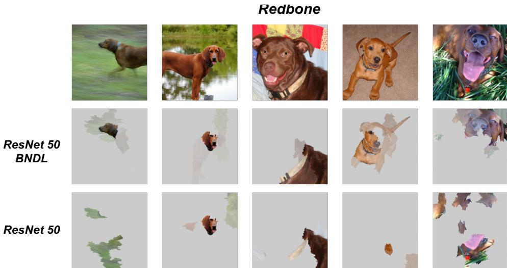

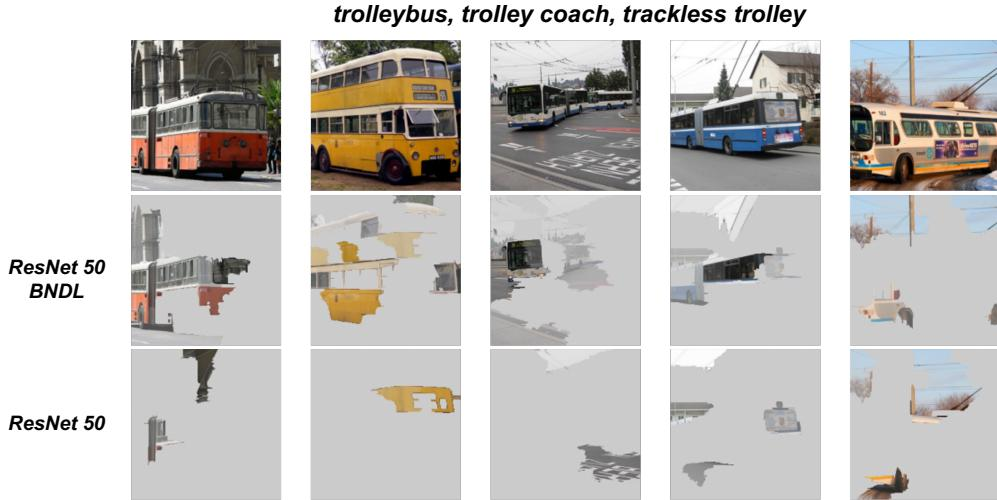

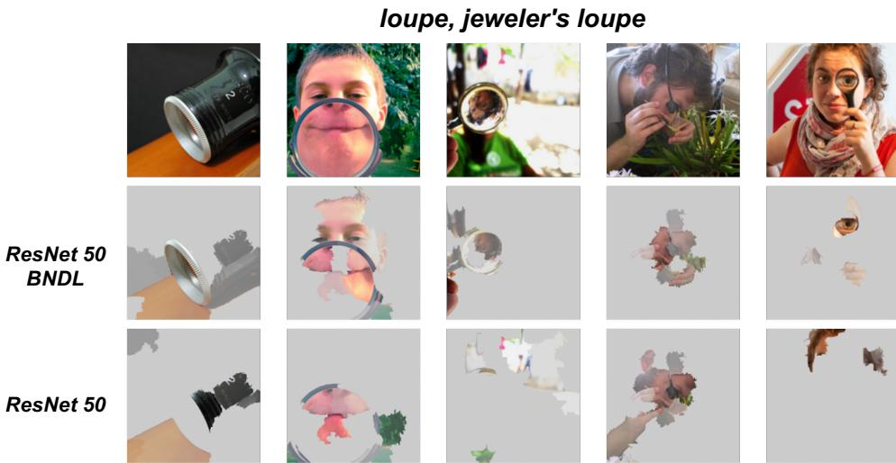

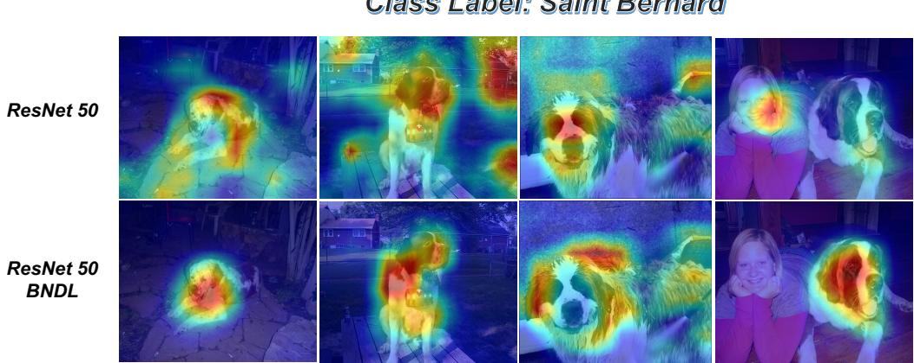

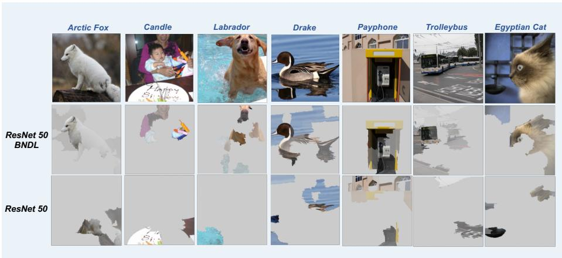

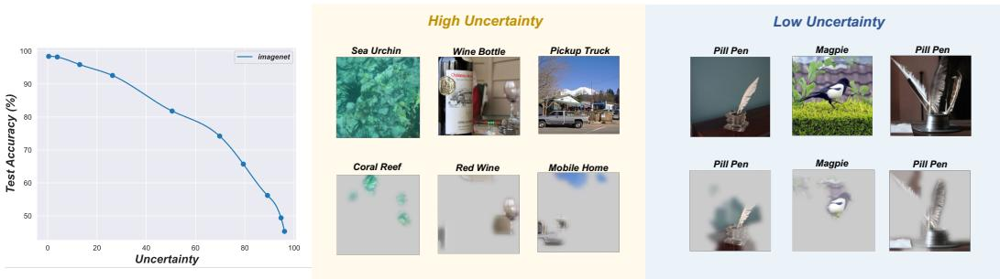

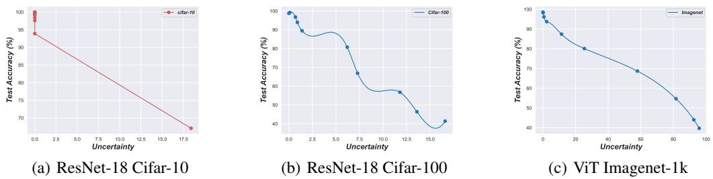

### Tables

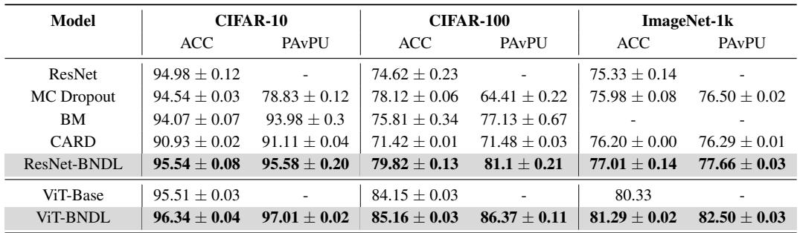

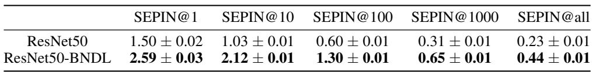

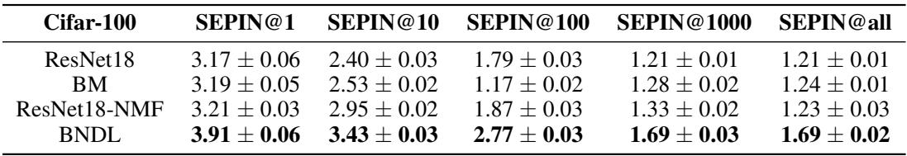

## MolSpectra: Pre-training 3D Molecular Representation with Multi-modal Energy Spectra

### Images

### Tables

## Building, Reusing, and Generalizing Abstract Representations from Concrete Sequences

### Images

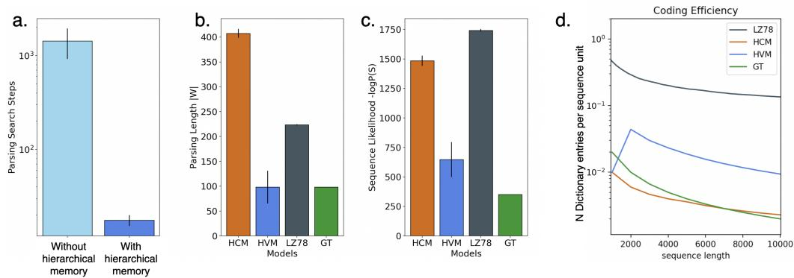

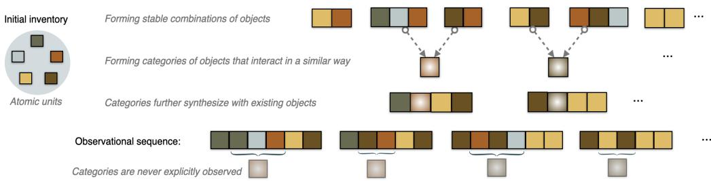

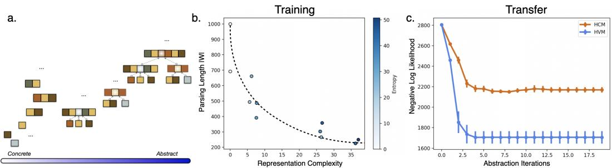

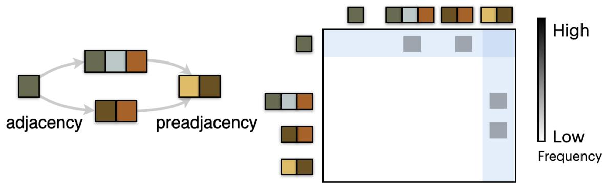

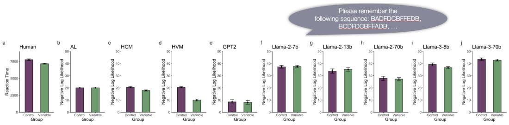

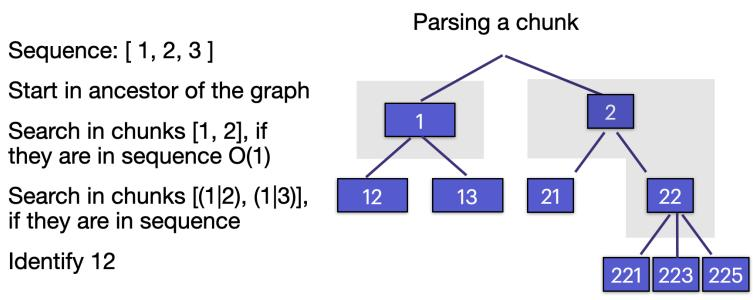

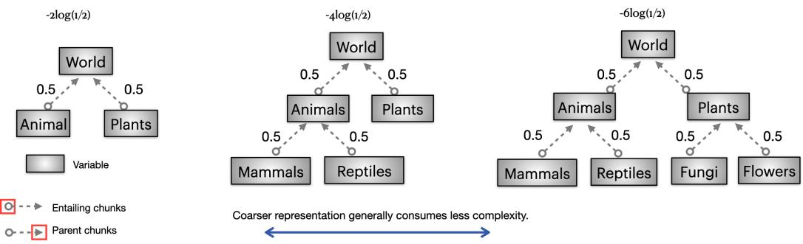

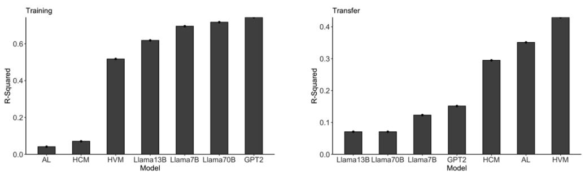

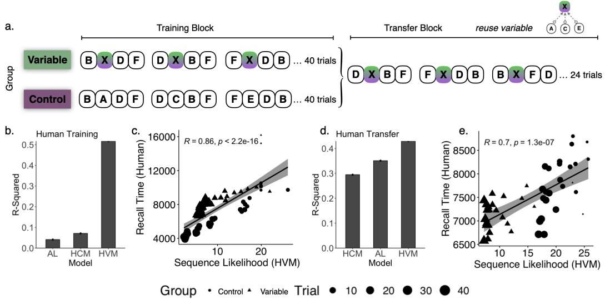

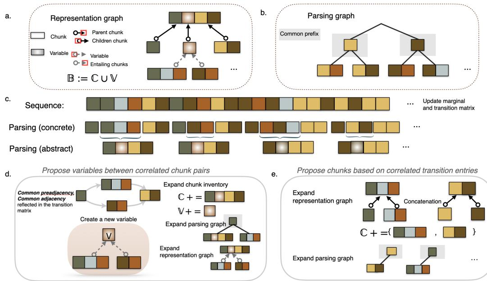

### Tables

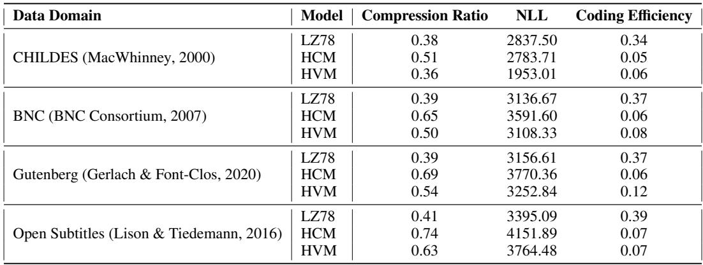

## (Mis)Fitting Scaling Laws: A Survey of Scaling Law Fitting Techniques in Deep Learning

### Images

Fitting Scaling Laws_ A Survey of Scaling Law Fitting Techniques in Deep Learning/images/1289e6297bbe965de8580e2143cf734d943d69a47cfd508225de482b6f32717b.jpg)

Fitting Scaling Laws_ A Survey of Scaling Law Fitting Techniques in Deep Learning/images/3f233e93b8421859fe9f0aa17fd9122213d19f4f80110d0eedb5cbe8857baa23.jpg)

Fitting Scaling Laws_ A Survey of Scaling Law Fitting Techniques in Deep Learning/images/42f0f2c5a166ca117e6b530ee73ebe8d4693d09b3dbfff1e15669b82be9a6c96.jpg)

Fitting Scaling Laws_ A Survey of Scaling Law Fitting Techniques in Deep Learning/images/73d4f492928377633368f2508a96fd2177cd9465c64b6df334fc6dce5cd086a6.jpg)

Fitting Scaling Laws_ A Survey of Scaling Law Fitting Techniques in Deep Learning/images/7f51ecce69217e0d5176c128cb6a3ce116a861cee506c54063d543949c518f64.jpg)

Fitting Scaling Laws_ A Survey of Scaling Law Fitting Techniques in Deep Learning/images/89d7f41ca377c98e430f1471b3481f45729a6deee895fa725c02525699e96901.jpg)

Fitting Scaling Laws_ A Survey of Scaling Law Fitting Techniques in Deep Learning/images/b944fe0477573868b0f09a42910cad5e039f7aaad2edd7ecb558a7578d79bba3.jpg)

Fitting Scaling Laws_ A Survey of Scaling Law Fitting Techniques in Deep Learning/images/c2f5f02c229aeb4ed90349b83e73b365ef5f12474fa76a814754706b09f7a3d4.jpg)

Fitting Scaling Laws_ A Survey of Scaling Law Fitting Techniques in Deep Learning/images/ccf30f4bd2c80d7e2512ca2eae6f1bb293865c92b1ef159c8a25df2da481f935.jpg)

Fitting Scaling Laws_ A Survey of Scaling Law Fitting Techniques in Deep Learning/images/d0a73f27211c2f1781c62b235b93b8f5add704f81357836b0f7e6d32ef5a89fa.jpg)

Fitting Scaling Laws_ A Survey of Scaling Law Fitting Techniques in Deep Learning/images/e1ac7e7c6b5db323f7eed1a7f063bc86c128204d4a007d59a00e5715a9ae9f14.jpg)

Fitting Scaling Laws_ A Survey of Scaling Law Fitting Techniques in Deep Learning/images/e6be003093e5319f0d68c6c88d1077f30999e95bc3ccc612b9513bae83676b3d.jpg)

Fitting Scaling Laws_ A Survey of Scaling Law Fitting Techniques in Deep Learning/images/ea99dca4eaae4b6fb90fe3925c4d2936bdd1d2b4fe1973172923817d6d186c50.jpg)

Fitting Scaling Laws_ A Survey of Scaling Law Fitting Techniques in Deep Learning/images/feb0e1873fbacd7f2f5ee1d77459b5622657e9f332b98c00ebb1d88676672ac3.jpg)

### Tables

Fitting Scaling Laws_ A Survey of Scaling Law Fitting Techniques in Deep Learning/tables/5d16a55c26f8df6b8acd6fecffcca05421eb68dbe5ab5400ea71652557ca5fe5.jpg)

Fitting Scaling Laws_ A Survey of Scaling Law Fitting Techniques in Deep Learning/tables/80241696b696e09744d1a902aeffcd3ae42474bd38a437046c9572bbf4e57b78.jpg)

Fitting Scaling Laws_ A Survey of Scaling Law Fitting Techniques in Deep Learning/tables/8438e22aec0ab95edd913848c7f64a5c4e07f473dde13faee3f63a5a78baaa39.jpg)

Fitting Scaling Laws_ A Survey of Scaling Law Fitting Techniques in Deep Learning/tables/9451640e98a6870fc736c3cf3f9d62a6bc69b10c420391cb65dd1924e66ab7e9.jpg)

Fitting Scaling Laws_ A Survey of Scaling Law Fitting Techniques in Deep Learning/tables/b2a47d084ce0b93174f8c81101b66debce11b01d0f62b08f64507cac8d8745a6.jpg)

Fitting Scaling Laws_ A Survey of Scaling Law Fitting Techniques in Deep Learning/tables/c23f82420e5b0d93a33398a822a732fc6b4e0726e0dadcb21358885509bcb078.jpg)

Fitting Scaling Laws_ A Survey of Scaling Law Fitting Techniques in Deep Learning/tables/c83de01937862938aa83c83f96069ffd7aed112eb7a937a488562d7a1c72e6ca.jpg)

Fitting Scaling Laws_ A Survey of Scaling Law Fitting Techniques in Deep Learning/tables/d61cd72d044c5bb38d1ebcf7ab5e336023801463ebfa0f3103498dcd3e068805.jpg)

Fitting Scaling Laws_ A Survey of Scaling Law Fitting Techniques in Deep Learning/tables/ec85d226548d7c69d68c935875bbf93d969052e4abab73c26e337a69b0c34f5e.jpg)

Fitting Scaling Laws_ A Survey of Scaling Law Fitting Techniques in Deep Learning/tables/f008bee8562ad0fad097f4146459568b636f20bb7006860f003a86e620f766f1.jpg)

## A Single Goal is All You Need: Skills and Exploration Emerge from Contrastive RL without Rewards, Demonstrations, or Subgoals

### Images

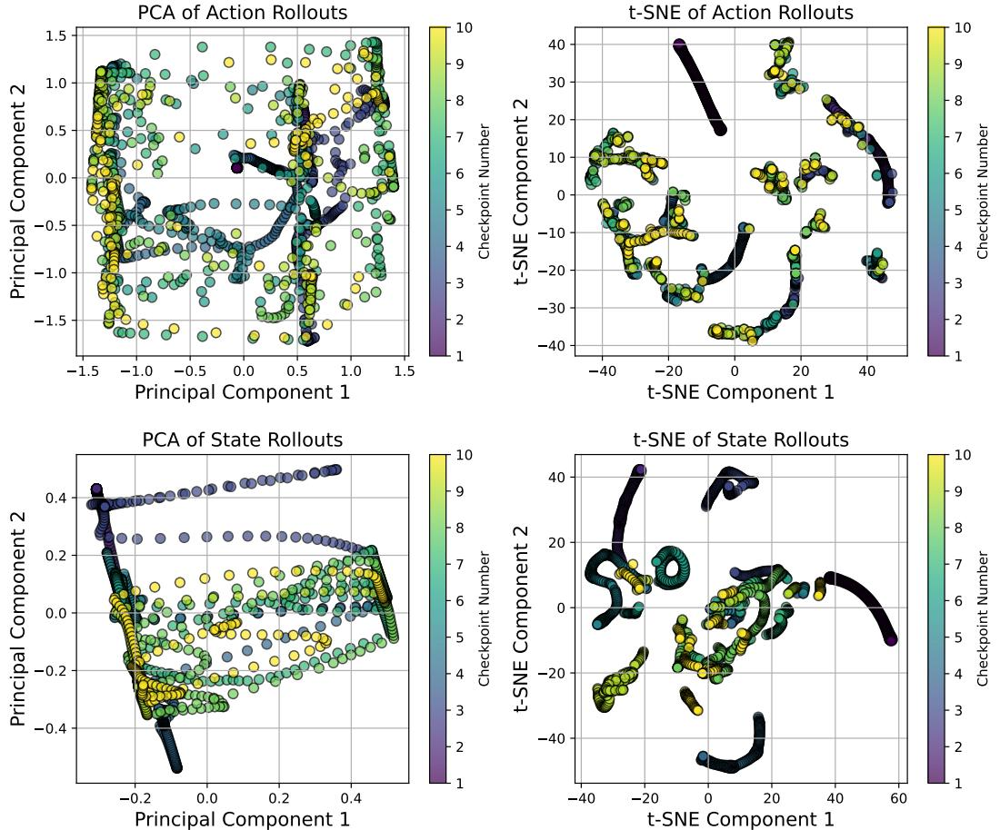

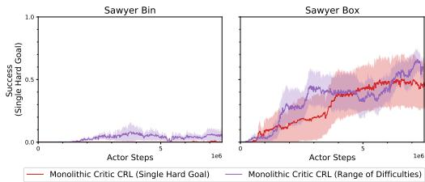

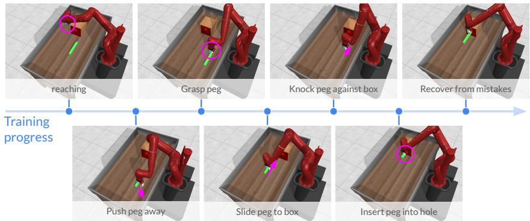

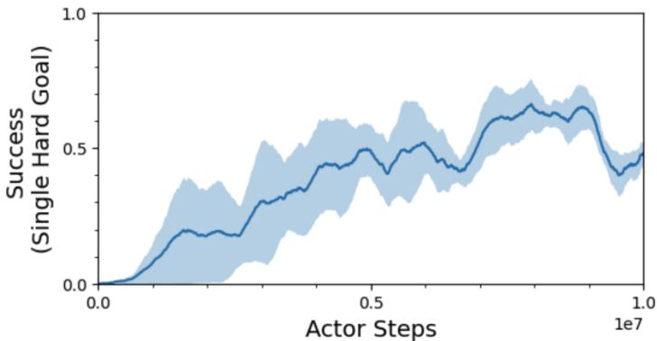

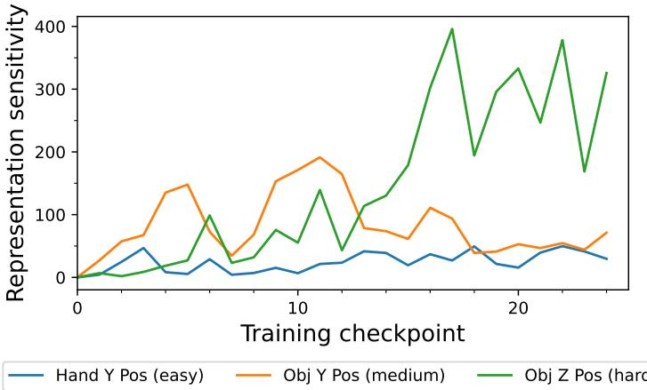

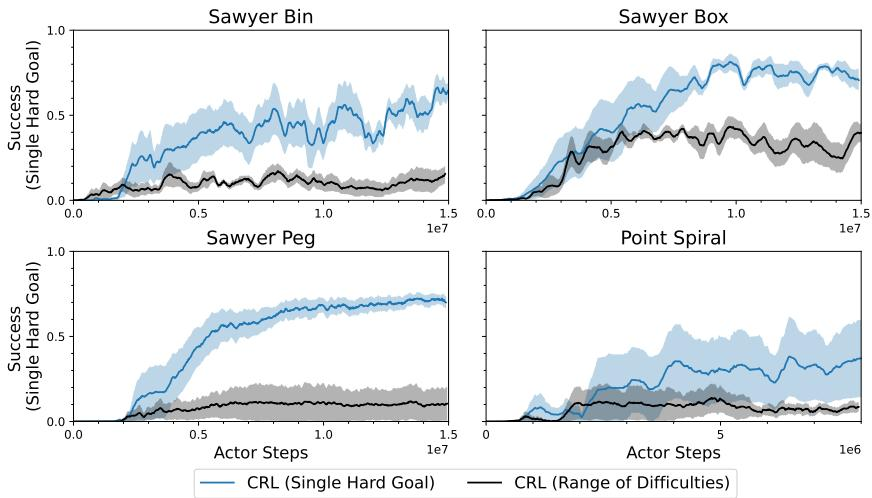

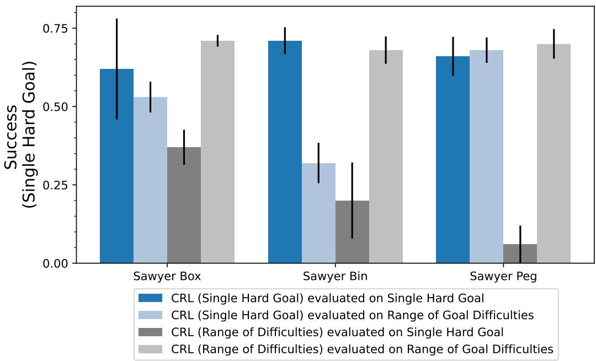

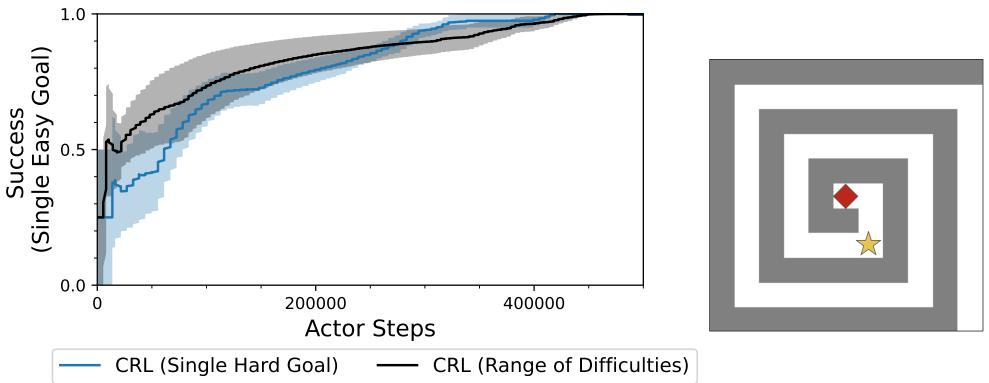

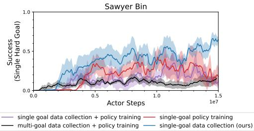

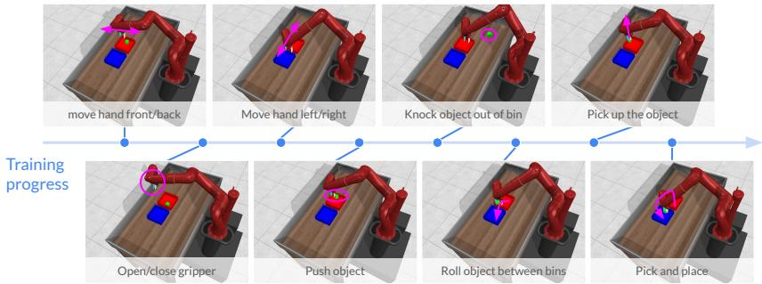

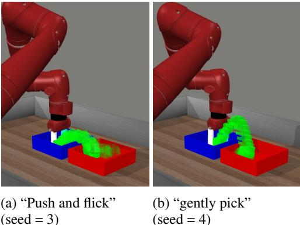

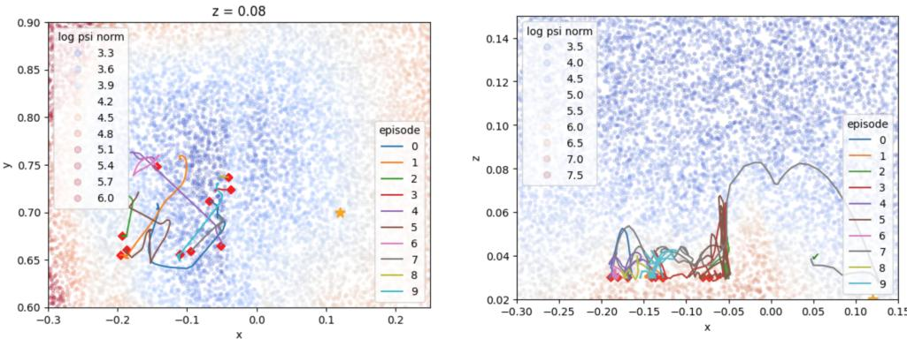

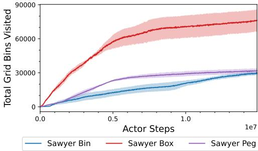

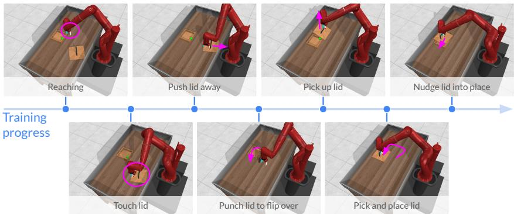

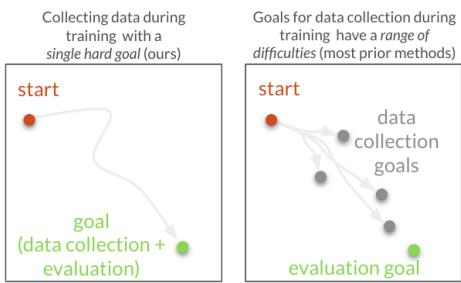

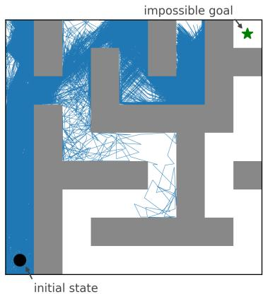

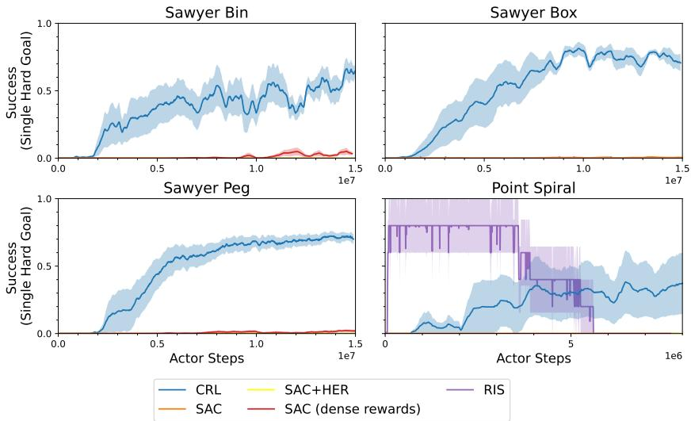

### Tables

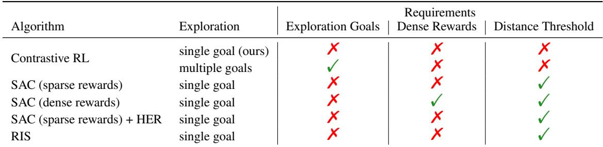

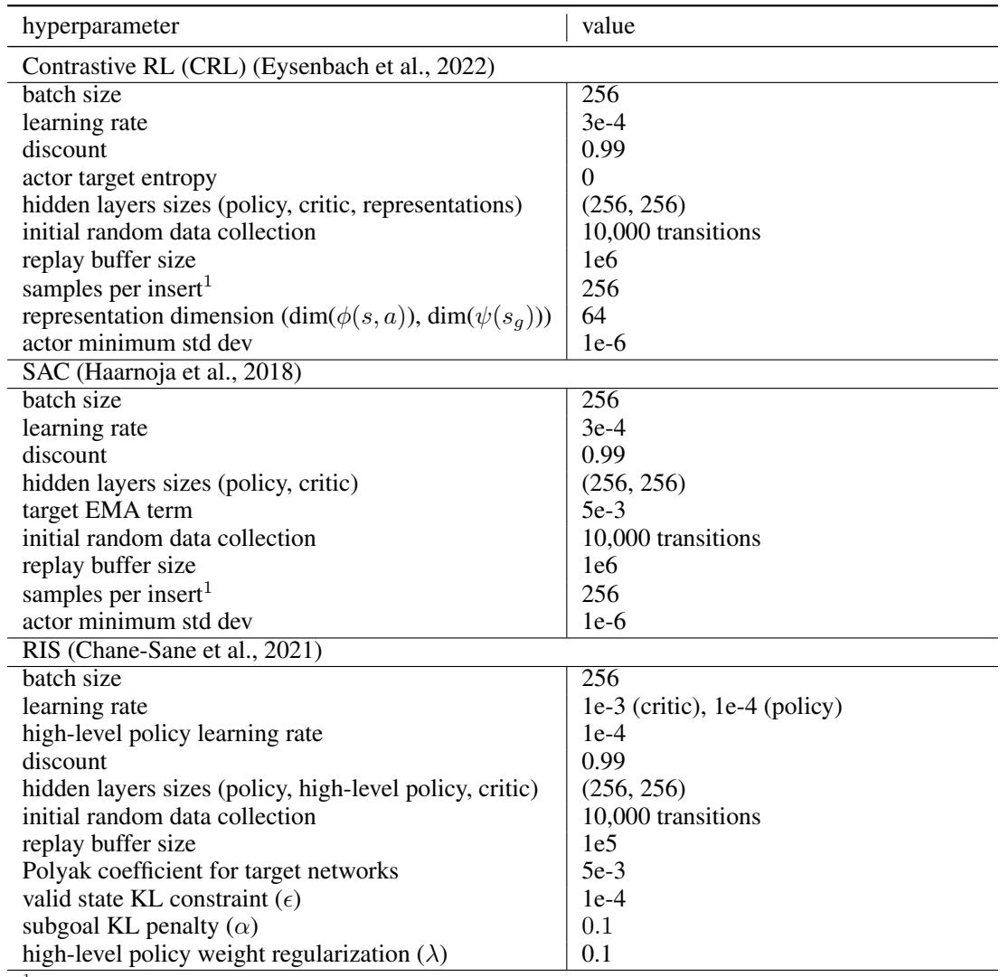

## Isometric Regularization for Manifolds of Functional Data

### Images

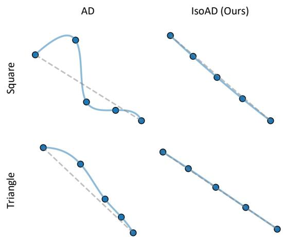

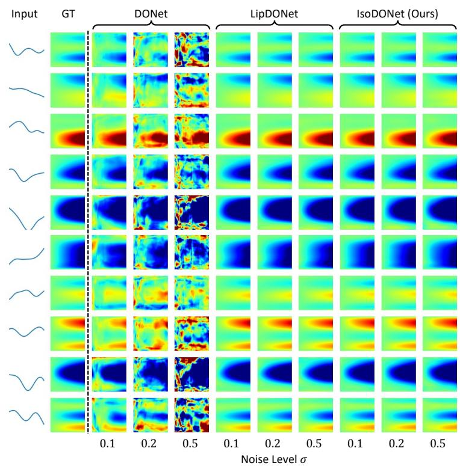

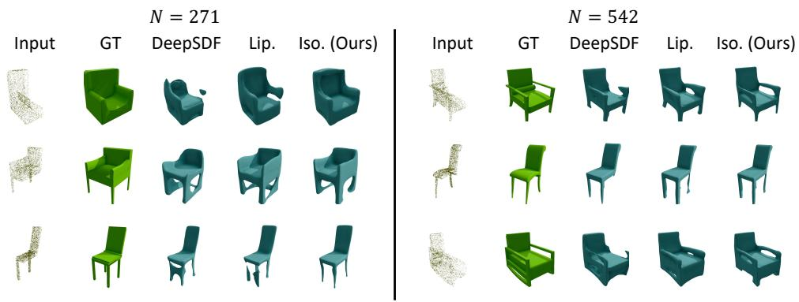

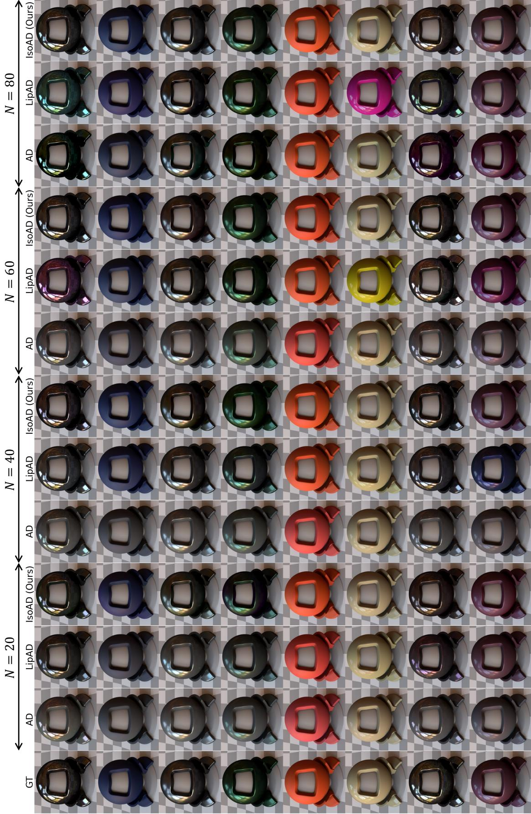

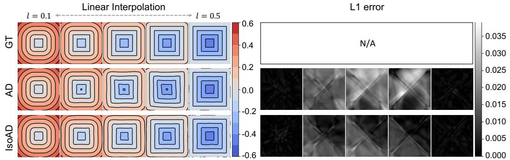


### Tables


## Beware of Calibration Data for Pruning Large Language Models

### Images


### Tables


## Active Learning for Neural PDE Solvers

### Images


### Tables


## Which Tasks Should Be Compressed Together? A Causal Discovery Approach for Efficient Multi-Task Representation Compression

### Images


### Tables


## MACPO: Weak-to-Strong Alignment via Multi-Agent Contrastive Preference Optimization

### Images


### Tables


## Scalable Universal T-Cell Receptor Embeddings from Adaptive Immune Repertoires

### Images


### Tables


## ZeroDiff: Solidified Visual-semantic Correlation in Zero-Shot Learning

### Images


### Tables


## Self-Supervised Diffusion MRI Denoising via Iterative and Stable Refinement

### Images


### Tables


## BlueSuffix: Reinforced Blue Teaming for Vision-Language Models Against Jailbreak Attacks

### Images


### Tables


## Adaptive Methods through the Lens of SDEs: Theoretical Insights on the Role of Noise

### Images


### Tables


## Failures to Find Transferable Image Jailbreaks Between Vision-Language Models

### Images


### Tables


## Learning Evolving Tools for Large Language Models

### Images

### Tables

## Feature Responsiveness Scores: Model-Agnostic Explanations for Recourse

### Images

### Tables

## A Spark of Vision-Language Intelligence: 2-Dimensional Autoregressive Transformer for Efficient Finegrained Image Generation

### Images

### Tables

## GaussianBlock: Building Part-Aware Compositional and Editable 3D Scene by Primitives and Gaussians

### Images

### Tables

## Improving Instruction-Following in Language Models through Activation Steering

### Images

### Tables

## Scaling Autonomous Agents via Automatic Reward Modeling And Planning

### Images

### Tables

## Explaining Modern Gated-Linear RNNs via a Unified Implicit Attention Formulation

### Images

### Tables

## PFDiff: Training-Free Acceleration of Diffusion Models Combining Past and Future Scores

### Images

### Tables

## Learning to Communicate Through Implicit Communication Channels

### Images

## RESfM: Robust Deep Equivariant Structure from Motion

### Images

### Tables

## Video In-context Learning: Autoregressive Transformers are Zero-Shot Video Imitators

### Images

### Tables

## ChroKnowledge: Unveiling Chronological Knowledge of Language Models in Multiple Domains

### Images

### Tables

## Aligning Visual Contrastive learning models via Preference Optimization

### Images

### Tables

## MGDA Converges under Generalized Smoothness, Provably

### Images

### Tables

## Making Text Embedders Few-Shot Learners

### Images

### Tables

## A Solvable Attention for Neural Scaling Laws

### Images

### Tables

## ST-GCond: Self-supervised and Transferable Graph Dataset Condensation

### Images

### Tables

## Learning Successor Features with Distributed Hebbian Temporal Memory

### Images

### Tables

## Inspection and Control of Self-Generated-Text Recognition Ability in Llama3-8b-Instruct

### Images

### Tables

## When GNNs meet symmetry in ILPs: an orbit-based feature augmentation approach

### Images

### Tables

