# ICLR 2025 Main Conference Papers

**Summary:** 37 papers with extracted content:
- 📊 Total images: 46210
- 📋 Total tables: 34695
- 📄 Total files: 80905

*Note: Equations have been filtered out and are not included.*

---

# ICLR 2025 Main Papers - Part 7 of 100

## 目录 (Table of Contents)

1. [Adjoint Matching: Fine-tuning Flow and Diffusion Generative Models with Memoryless Stochastic Optimal Control](#Adjoint-Matching-Fine-tuning-Flow-and-Diffusion-Generative-Models-with-Memoryless-Stochastic-Optimal-Control)
2. [Better autoregressive regression with LLMs via regression-aware fine-tuning](#Better-autoregressive-regression-with-LLMs-via-regression-aware-fine-tuning)
3. [The Power of LLM-Generated Synthetic Data for Stance Detection in Online Political Discussions](#The-Power-of-LLM-Generated-Synthetic-Data-for-Stance-Detection-in-Online-Political-Discussions)
4. [CausalRivers - Scaling up benchmarking of causal discovery for real-world time-series](#CausalRivers-Scaling-up-benchmarking-of-causal-discovery-for-real-world-time-series)
5. [Tuning Frequency Bias of State Space Models](#Tuning-Frequency-Bias-of-State-Space-Models)
6. [Provably Accurate Shapley Value Estimation via Leverage Score Sampling](#Provably-Accurate-Shapley-Value-Estimation-via-Leverage-Score-Sampling)
7. [GrabS: Generative Embodied Agent for 3D Object Segmentation without Scene Supervision](#GrabS-Generative-Embodied-Agent-for-3D-Object-Segmentation-without-Scene-Supervision)
8. [Diffusion On Syntax Trees For Program Synthesis](#Diffusion-On-Syntax-Trees-For-Program-Synthesis)
9. [Effective Interplay between Sparsity and Quantization: From Theory to Practice](#Effective-Interplay-between-Sparsity-and-Quantization-From-Theory-to-Practice)
10. [VLMaterial: Procedural Material Generation with Large Vision-Language Models](#VLMaterial-Procedural-Material-Generation-with-Large-Vision-Language-Models)
11. [Analyzing Neural Scaling Laws in Two-Layer Networks with Power-Law Data Spectra](#Analyzing-Neural-Scaling-Laws-in-Two-Layer-Networks-with-Power-Law-Data-Spectra)
12. [Test-time Alignment of Diffusion Models without Reward Over-optimization](#Test-time-Alignment-of-Diffusion-Models-without-Reward-Over-optimization)
13. [SVDQuant: Absorbing Outliers by Low-Rank Component for 4-Bit Diffusion Models](#SVDQuant-Absorbing-Outliers-by-Low-Rank-Component-for-4-Bit-Diffusion-Models)
14. [Decomposition Polyhedra of Piecewise Linear Functions](#Decomposition-Polyhedra-of-Piecewise-Linear-Functions)
15. [Layer Swapping for Zero-Shot Cross-Lingual Transfer in Large Language Models](#Layer-Swapping-for-Zero-Shot-Cross-Lingual-Transfer-in-Large-Language-Models)
16. [UniMatch: Universal Matching from Atom to Task for Few-Shot Drug Discovery](#UniMatch-Universal-Matching-from-Atom-to-Task-for-Few-Shot-Drug-Discovery)
17. [SynFlowNet: Design of Diverse and Novel Molecules with Synthesis Constraints](#SynFlowNet-Design-of-Diverse-and-Novel-Molecules-with-Synthesis-Constraints)
18. [Counterfactual Realizability](#Counterfactual-Realizability)
19. [How Much is Unseen Depends Chiefly on Information About the Seen](#How-Much-is-Unseen-Depends-Chiefly-on-Information-About-the-Seen)
20. [Can Watermarked LLMs be Identified by Users via Crafted Prompts?](#Can-Watermarked-LLMs-be-Identified-by-Users-via-Crafted-Prompts)
21. [IGL-Bench: Establishing the Comprehensive Benchmark for Imbalanced Graph Learning](#IGL-Bench-Establishing-the-Comprehensive-Benchmark-for-Imbalanced-Graph-Learning)
22. [Weighted Point Set Embedding for Multimodal Contrastive Learning Toward Optimal Similarity Metric](#Weighted-Point-Set-Embedding-for-Multimodal-Contrastive-Learning-Toward-Optimal-Similarity-Metric)
23. [On the Expressiveness of Rational ReLU Neural Networks With Bounded Depth](#On-the-Expressiveness-of-Rational-ReLU-Neural-Networks-With-Bounded-Depth)
24. [Enhancing the Scalability and Applicability of Kohn-Sham Hamiltonians for Molecular Systems](#Enhancing-the-Scalability-and-Applicability-of-Kohn-Sham-Hamiltonians-for-Molecular-Systems)
25. [Improving Convergence Guarantees of Random Subspace Second-order Algorithm for Nonconvex Optimization](#Improving-Convergence-Guarantees-of-Random-Subspace-Second-order-Algorithm-for-Nonconvex-Optimization)
26. [Temporal Heterogeneous Graph Generation with Privacy, Utility, and Efficiency](#Temporal-Heterogeneous-Graph-Generation-with-Privacy-Utility-and-Efficiency)
27. [Knowledge Localization: Mission Not Accomplished? Enter Query Localization!](#Knowledge-Localization-Mission-Not-Accomplished-Enter-Query-Localization)
28. [Boosting Ray Search Procedure of Hard-label Attacks with Transfer-based Priors](#Boosting-Ray-Search-Procedure-of-Hard-label-Attacks-with-Transfer-based-Priors)
29. [Uncovering Overfitting in Large Language Model Editing](#Uncovering-Overfitting-in-Large-Language-Model-Editing)
30. [Effective post-training embedding compression via temperature control in contrastive training](#Effective-post-training-embedding-compression-via-temperature-control-in-contrastive-training)
31. [Bundle Neural Network for message diffusion on graphs](#Bundle-Neural-Network-for-message-diffusion-on-graphs)
32. [Benchmarking Predictive Coding Networks -- Made Simple](#Benchmarking-Predictive-Coding-Networks-Made-Simple)
33. [Graph Neural Networks Can (Often) Count Substructures](#Graph-Neural-Networks-Can-Often-Count-Substructures)
34. [LiveBench: A Challenging, Contamination-Limited LLM Benchmark](#LiveBench-A-Challenging-Contamination-Limited-LLM-Benchmark)
35. [Emergent Orientation Maps —— Mechanisms, Coding Efficiency and Robustness](#Emergent-Orientation-Maps-Mechanisms-Coding-Efficiency-and-Robustness)
36. [PianoMotion10M: Dataset and Benchmark for Hand Motion Generation in Piano Performance](#PianoMotion10M-Dataset-and-Benchmark-for-Hand-Motion-Generation-in-Piano-Performance)
37. [UniCBE: An Uniformity-driven Comparing Based Evaluation Framework with Unified Multi-Objective Optimization](#UniCBE-An-Uniformity-driven-Comparing-Based-Evaluation-Framework-with-Unified-Multi-Objective-Optimization)

---

## Adjoint Matching: Fine-tuning Flow and Diffusion Generative Models with Memoryless Stochastic Optimal Control

### Images

### Tables

## Adjoint Matching: Fine-tuning Flow and Diffusion Generative Models with Memoryless Stochastic Optimal Control

### Images

### Tables

## Better autoregressive regression with LLMs via regression-aware fine-tuning

### Images

### Tables

## The Power of LLM-Generated Synthetic Data for Stance Detection in Online Political Discussions

### Images

### Tables

## CausalRivers - Scaling up benchmarking of causal discovery for real-world time-series

### Images

### Tables

## Tuning Frequency Bias of State Space Models

### Images

### Tables

## Provably Accurate Shapley Value Estimation via Leverage Score Sampling

### Images

### Tables

## GrabS: Generative Embodied Agent for 3D Object Segmentation without Scene Supervision

### Images

### Tables

## Diffusion On Syntax Trees For Program Synthesis

### Images

### Tables

## Effective Interplay between Sparsity and Quantization: From Theory to Practice

### Images

### Tables

## VLMaterial: Procedural Material Generation with Large Vision-Language Models

### Images

### Tables

## Analyzing Neural Scaling Laws in Two-Layer Networks with Power-Law Data Spectra

### Images

## Test-time Alignment of Diffusion Models without Reward Over-optimization

### Images

### Tables

## SVDQuant: Absorbing Outliers by Low-Rank Component for 4-Bit Diffusion Models

### Images

### Tables

## Decomposition Polyhedra of Piecewise Linear Functions

### Images

## Layer Swapping for Zero-Shot Cross-Lingual Transfer in Large Language Models

### Images

### Tables

## UniMatch: Universal Matching from Atom to Task for Few-Shot Drug Discovery

### Images

### Tables

## SynFlowNet: Design of Diverse and Novel Molecules with Synthesis Constraints

### Images

### Tables

## Counterfactual Realizability

### Images

### Tables

## How Much is Unseen Depends Chiefly on Information About the Seen

### Images

### Tables

## Can Watermarked LLMs be Identified by Users via Crafted Prompts?

### Images

### Tables

## IGL-Bench: Establishing the Comprehensive Benchmark for Imbalanced Graph Learning

### Images

### Tables

## Weighted Point Set Embedding for Multimodal Contrastive Learning Toward Optimal Similarity Metric

### Images

### Tables

## On the Expressiveness of Rational ReLU Neural Networks With Bounded Depth

### Images

## Enhancing the Scalability and Applicability of Kohn-Sham Hamiltonians for Molecular Systems

### Images

### Tables

## Improving Convergence Guarantees of Random Subspace Second-order Algorithm for Nonconvex Optimization

### Images

### Tables

## Temporal Heterogeneous Graph Generation with Privacy, Utility, and Efficiency

### Images

### Tables

## Knowledge Localization: Mission Not Accomplished? Enter Query Localization!

### Images

### Tables

## Boosting Ray Search Procedure of Hard-label Attacks with Transfer-based Priors

### Images

### Tables

## Uncovering Overfitting in Large Language Model Editing

### Images

### Tables

## Effective post-training embedding compression via temperature control in contrastive training

### Images

### Tables

## Bundle Neural Network for message diffusion on graphs

### Images

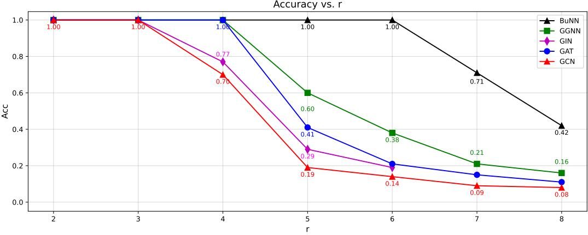

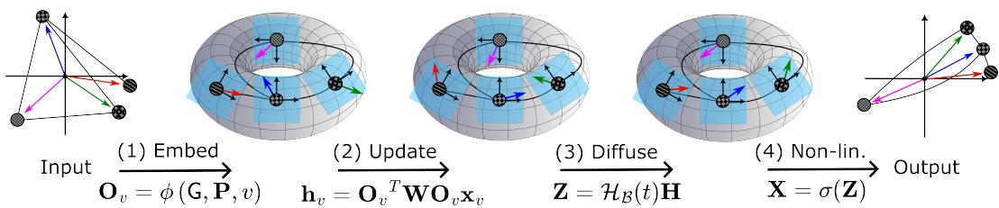

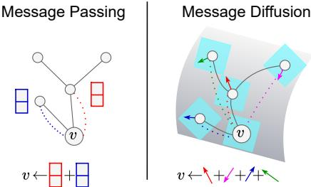

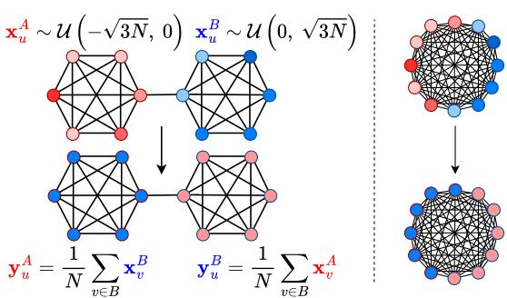

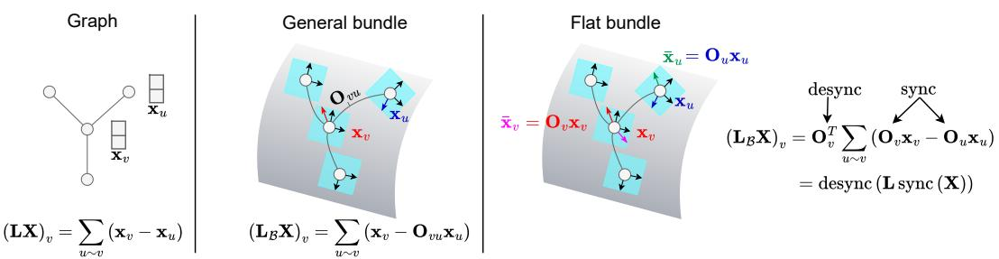

### Tables

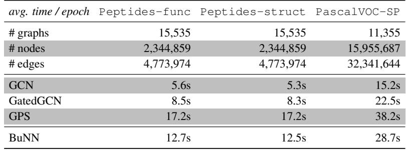

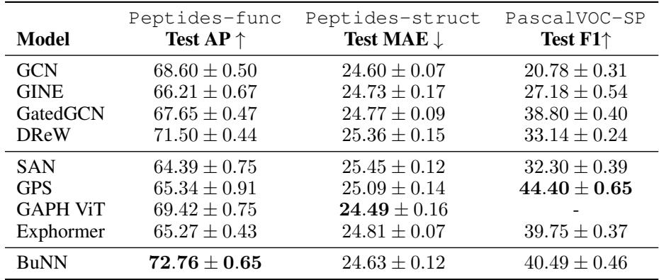

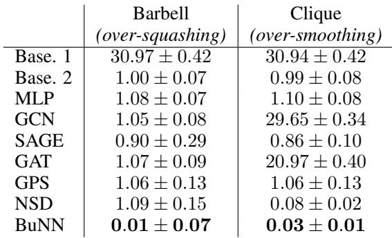

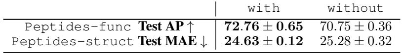

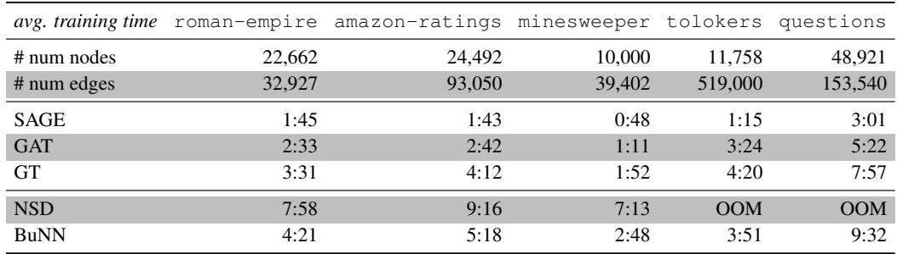

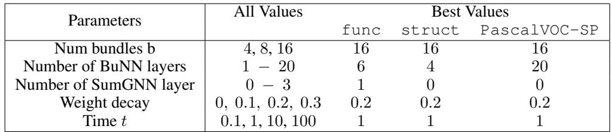

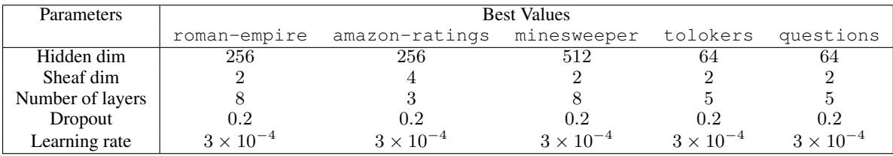

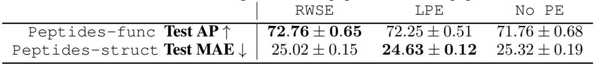

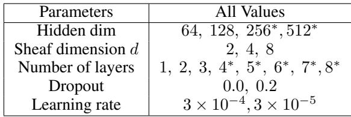

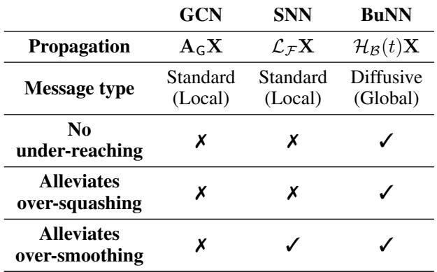

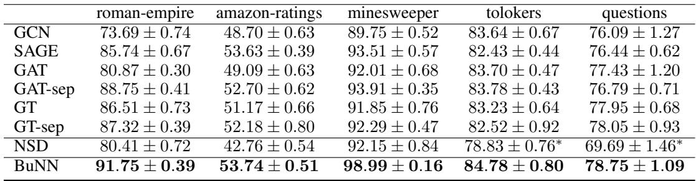

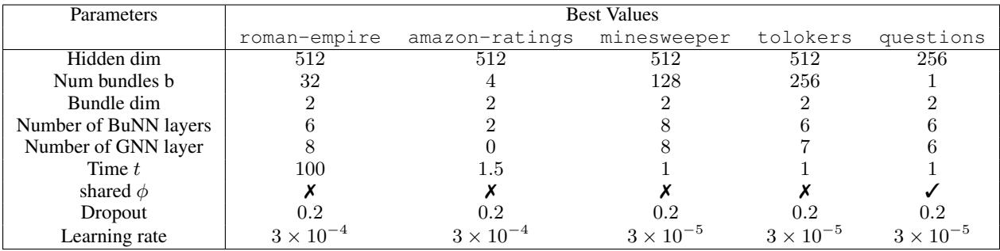

## Benchmarking Predictive Coding Networks -- Made Simple

### Images

### Tables

## Graph Neural Networks Can (Often) Count Substructures

### Images

 Count Substructures/images/319d11c683529b4019d46f60377ae59bf5964fa15c9157c6058231d51f803816.jpg)

 Count Substructures/images/37cf8ddaddff60a70bc7a7c9d58c1d637c6762467ae209ec52397b2b878a549c.jpg)

 Count Substructures/images/605d5b6e938468a4f00aec66e1ed682d3c8f08658d9f199203690081ff5c3b42.jpg)

 Count Substructures/images/a1fd89b984bcc8656b9c52feba81ea9146d1a96c85bc9bd58ca82b82980dc1bb.jpg)

 Count Substructures/images/dca59960a862992807b2f5f1354cc60a0e4f7475c878527a19349cdacb5ee2a7.jpg)

 Count Substructures/images/e9ca9d8efa9643c0730b590c79d000853300b4377a7268b8d5e5045e13476022.jpg)

### Tables

 Count Substructures/tables/45f2d129e927a74658a9fb1077f94b3a3598bb36a98dfd144b34c08ef35b99de.jpg)

 Count Substructures/tables/6c13ab34c813ec91579c4a789f64f505926ae741f4a500ce17fd6e09a5a3c632.jpg)

 Count Substructures/tables/a22f6d5d023db65d11d24409a7b7477d5896e63d5ddffe82e21ea69fdc4e2183.jpg)

 Count Substructures/tables/c00ba65d57a38b6c25f546fbe00baa79c8849edaa8ede070df7e890642d401d1.jpg)

 Count Substructures/tables/de889426abe47e03a3d9603f3fd02966a8cdf35ed8d4cbf0099eba62e3fa24db.jpg)

 Count Substructures/tables/dee2302263ba132672662bc6b9e10b729eea5cc148381e8e7b63f41116f35500.jpg)

 Count Substructures/tables/eb5037171672dc4c70da3aa3057f9aff8337c01b06f7dbc366f525be03f1a9e1.jpg)

 Count Substructures/tables/f032e444caa8ecc948703bcbccfa968257e7891a9bb56e253b1e20a1ceeb7e72.jpg)

## LiveBench: A Challenging, Contamination-Limited LLM Benchmark

### Images

### Tables

## Emergent Orientation Maps —— Mechanisms, Coding Efficiency and Robustness

### Images

### Tables

## PianoMotion10M: Dataset and Benchmark for Hand Motion Generation in Piano Performance

### Images

### Tables

## UniCBE: An Uniformity-driven Comparing Based Evaluation Framework with Unified Multi-Objective Optimization

### Images

### Tables

